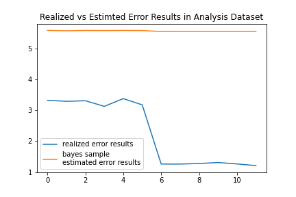

# Bayesian Estimation of Residual distribution

In this problem we want to find the distribution of residuals given the point predictions and outcomes of a
regression Machine Learning model.

We are looking into this problem so that we can use the learnt distribution of residuals in order to estimate the performance
of a regression machine learning model on new data. This approach would only work when there is no concept drift.

We looked into many methods of getting a distribution of residuals from point predictions and outcomes. However in
this case we are focusing on a Bayesian approach. We think our approach is sound on the high level but has some
implementation issues that need resolving before it can give descent results.

## Setting Up

We assume you have installed `conda` in the way most appropriate for your system.
The following commands will create an appropriate environment.

```
$ conda create -c conda-forge -n dev1 "pymc>=4" python=3.9
$ conda activate dev1
$ conda install -c conda-forge jupyterlab scikit-learn python-graphviz

```

## Running the Notebooks

- First we run `NB0 Create Dataset.ipynb` to create the dataset we will use.<br>
  The dataset has 4 numerical features, and a target that is a linear combination of those features. We have also added
  heteroscedastic gaussian noise with standard deviation being the square of feature4.
  We also train a `GradientBoostingRegressor` on those target values.
- Then we run `NB1 PYMC Estimate Posterior.ipynb` where we are trying to predict the distribution of residuals of what our
  model predicts versus the actual target. We are using `pymc` to do that. To evaluate the learnt distribution of residuals
  we are using [mean absolute error](https://scikit-learn.org/stable/modules/generated/sklearn.metrics.mean_absolute_error.html)

## Evaluating results

Here's a plot of the final results:



Some general remarks regarding the results are:

- The results are unstable, I am probably not using a proper way to fix the seed and make the results reproducible.
  However re-running the notebook, may not yield the same (or similar enough) results as a previous run.
- The estimated error from the learnt distribution of residuals is not close to the actual error.

We should also note here that we have tested other methods that work better in this problem.
One of them is to use points close to a given point in order to fit an assumed distribution shape.
We then use those parameters as labels to train a machine learning model to predict them.
We can then predict the distribution of residuals through this process. This approach yields better results
than the one we demonstrated here, but conceptually the processes share similarities.

## Potential remedies?

- Problem can be formulated in a better way?
- `pymc` can be used in a better way?
